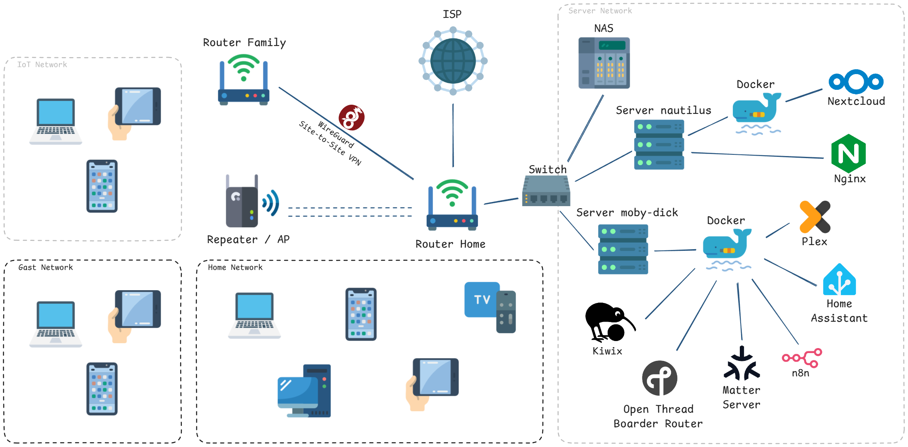

# 🏠 My HomeLab
Welcome to my HomeLab repository! Here you will find the documentation, configurations and infrastructure details of my personal setup.

---

---

## 🖥️ Hardware
| Device | Model/Specs | RAM | Storage | Services |
| :--- | :--- | :--- | :--- | :--- | 
| **Server nautilus** | TERRA_PC / Intel Celeron N3050 | 4 GB | 256 GB SSD | Nextcloud, Nginx |
| **Server moby-dick** | Z170A GAMING M3 / Intel i5-6600K | 8 GB | 256 GB SSD | Homeassistant, Plex, n8n, Open Thread Boarder Router, Matter Server, Kiwix |
| **NAS Datenkrake** | QNAP TS-212P | 512 MB | 2 x 4 TB HDD in RAID 1 | Data Storage |

---

## 🌐 Network Structure
- **Router/Firewall:** FRITZ!Box 7530 AX
- **Switches:** NETGEAR 8 Port Switch Ethernet (GS108GE) 
- **Access Points:** Router and AVM FRITZ! Repeater 1200 AX
- **VLANs:** in work 💸

---

## 🐋 Hosted Services

Here is a list of the main services running in my HomeLab (mostly via Docker)

### Core Infrastructure
- **[Docker](https://www.docker.com/)** - Easy Deployment and management
- **[Nginx Proxy Manager](https://nginx.org/)** - Reverse Proxy & SSL Certificates

### Media & Productivity
- **[Nextcloud](https://nextcloud.com/)** - Personal Cloud Storage & Sync
- **[Plex](https://www.plex.tv/)** - Media Server
- **[Kiwix](https://kiwix.org)** - Offline Knowledge

### Smart Home & Monitoring
- **[Home Assistant](https://www.home-assistant.io/)** - Smart Home Automation
- **[Open Thread Boarder Router](https://openthread.io/)** - Own Thread Network 
- **[Matter Server](https://github.com/matter-js/python-matter-server)** - For Thread over Matter Network

---

## ⚙️ Automation & Tools
- **OS:** Ubuntu Server
- **Containerization:** Docker Compose

---

## 🎯 Future Plans / To-Do
- [x] Implement a Switch
- [ ] Implement VLANs
- [ ] Implement more Monitoring and IDS with Grafana
- [ ] Implement Paperless NGX